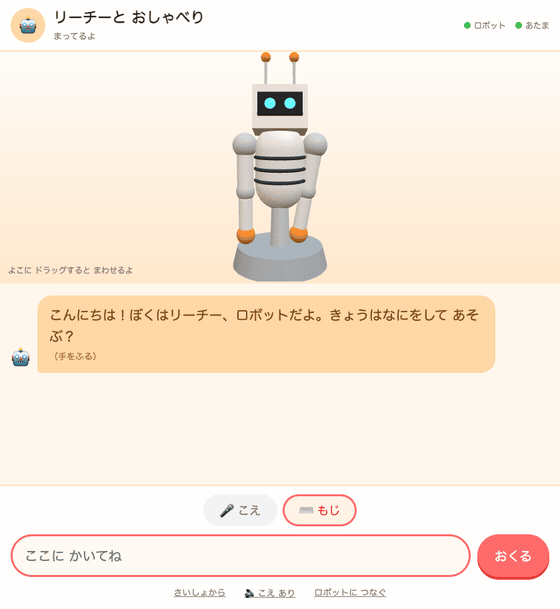
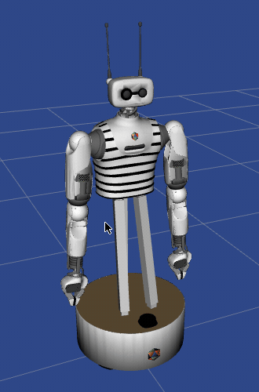

# リーチーと おしゃべり — Reachy 2 シミュレータ × 子供向け会話

Reachy 2 のシミュレータを立ち上げて、子供が声または文字で Reachy とおしゃべりできます。
返事の内容に合わせて、シミュレータの中の Reachy がうなずいたり、手をふったり、
よろこんだりします。



会話・音声認識・読み上げは **すべて手元のマシンの中で完結**します。
子供の声も話した内容も、外部のサービスには送られません。

```
ブラウザ ──WebSocket──> 会話サーバ ──> Ollama (ローカル LLM)
 こえ/もじ  ↑                 │
   3D表示 ──┘ 関節角 30Hz     └────────> Reachy 2 シミュレータ (gRPC :50051)
```

3D の Reachy は**ブラウザ側で描いています**。シミュレータの実際の関節角を
30Hz で受け取って反映しているので、動きは本物です。かたちは子供向けに
簡略化してあります（理由は[3D 表示について](#3d-表示について)）。

## 動作を確認した環境

| | |
| --- | --- |
| マシン | MacBook（Apple M5 / メモリ 24GB） |
| OS | macOS 15 |
| Docker Desktop | 29.5.3 |
| Python | 3.12 |
| ブラウザ | Chrome |
| シミュレータ | `pollenrobotics/reachy2:1.7.5.9` |
| LLM | Ollama + `gemma3:4b` |

**読み上げに macOS の `say` コマンドを使っているため、現状は macOS 前提**です。
ほかの OS で動かす場合は [server/speech.py](server/speech.py) の `synthesize()` を
その OS の音声合成に差し替えてください。会話と 3D 表示の部分は OS に依存しません。

## つかいかた

```bash
./scripts/start.sh
```

- おしゃべり画面: <http://localhost:8000> — 3D の Reachy もこの画面の中にいます

止めるときは、サーバは `Ctrl-C`、シミュレータは `./scripts/stop.sh` です。

画面では **「🎤 こえ」** と **「⌨️ もじ」** をタブで切り替えられます。
こえの場合はマイクのボタンを押して話し、話し終わって 1.6 秒だまると自動で送られます。

ブラウザは **Chrome を推奨**します（マイク録音の形式が安定しているため）。
`localhost` なので https でなくてもマイクが使えます。

## 準備（最初の 1 回だけ）

### 1. Docker Desktop

Reachy 2 の公式イメージは amd64 版しかありません。Apple Silicon の場合は
Rosetta を有効にします。

> Settings → General → **Use Rosetta for x86/amd64 emulation on Apple Silicon**

確認します。`x86_64` と出れば大丈夫です。

```bash
docker run --rm --platform linux/amd64 busybox uname -m
```

### 2. Ollama

```bash
brew install ollama && brew services start ollama
ollama pull gemma3:4b
```

### 3. Python 環境

Python 3.10 以上が必要です（macOS 標準の 3.9 では動きません）。

```bash
python3.12 -m venv .venv
.venv/bin/pip install -r requirements.txt
```

## 中身

| ファイル | 役割 |
| --- | --- |
| [sim/compose.yaml](sim/compose.yaml) | シミュレータ（公式 Docker イメージ）の起動設定 |
| [server/app.py](server/app.py) | 会話サーバ。WebSocket・読み上げ・音声認識・ジェスチャー API |
| [server/brain.py](server/brain.py) | Ollama への問い合わせ、子供向けプロンプト、安全のしくみ |
| [server/robot.py](server/robot.py) | Reachy のジェスチャー定義と再生 |
| [server/speech.py](server/speech.py) | 読み上げと音声認識 |
| [web/index.html](web/index.html) | 子供向けの画面 |
| [web/reachy3d.js](web/reachy3d.js) | ブラウザ側の 3D Reachy（three.js） |

## 3D 表示について

公式イメージには RViz が入っていますが、**既定では切ってあります**。

Docker はコンテナに GPU を渡せないため、RViz はソフトウェア描画になります。
確認した環境（Apple Silicon + Rosetta）で実測すると、CPU を 1.5 コアほど使って
**約 10fps** でした。ほかの処理と CPU を取り合うと 2〜3fps まで落ちます。

そこで**描画だけをブラウザに移しました**。シミュレータは制御と SDK サーバに専念し、
関節角を `/ws/pose` から 30Hz で送るだけです。ブラウザは GPU を使って 60fps で描きます。

- かたちは [web/reachy3d.js](web/reachy3d.js) の中で組み立てています。
  色や大きさは `COLORS` と各 `build*()` を触れば変えられます。
- 首・アンテナ・両腕の角度はシミュレータの実際の値です。手首や指は省略しています。
- 画面を横にドラッグすると、Reachy をまわして見られます。

コンテナの中の RViz を見たいときは [sim/compose.yaml](sim/compose.yaml) の
`start_rviz:=false` を `true` に戻すと
<http://localhost:6080/vnc.html?autoconnect=1&resize=remote> で見られます。
動作は確認済みですが、そのぶん CPU を使い、会話が遅くなります。

RViz の見え方はこのようになります（RViz ウィンドウのうち 3D 表示の部分を切り出したもの）。
手をふったあと、首を振ったりおじぎをしたりしています。



## ジェスチャー

LLM は返事と一緒に動きを 1 つ選びます。

`nod`（うなずく）`shake`（いやいや）`tilt`（首をかしげる）`happy`（よろこぶ）
`surprised`（びっくり）`think`（かんがえる）`wave`（手をふる）`bow`（おじぎ）`idle`

単体で試すには次のようにします。

```bash
curl -X POST http://localhost:8000/api/motion/wave
```

追加や調整は [server/robot.py](server/robot.py) の `_GESTURES` で行います。
`("head", roll, pitch, yaw, 秒)` / `("ant", 左, 右, 秒)` / `("arm", [7関節], 秒)` /
`("wait", 秒)` を並べるだけです。

### 追加するときの注意

**角度はすべて絶対角で書いてください。**
新しい動きが来ると、再生中のものは途中で打ち切られます。相対回転で書くと
「元に戻す」ステップが実行されないまま次に進み、ズレが会話のたびに積み重なって
首が傾いたままになります。絶対角なら、どこで中断されても次のジェスチャーが
正しい姿勢へ引き戻せます。

同じ理由で、**どのジェスチャーも最後は `_HEAD_NEUTRAL` とアンテナ 0 に戻して**ください。
「なにもしない」の `idle` も、固まるのではなく中立へ戻す動きとして定義してあります。

手をふる `wave` は右手だけを使います（人が片手であいさつするのに合わせています）。
両手にしたい場合は `wave` に `l_arm` 用のステップを足してください。

## 安全のしくみ

小さいモデルは、言い方を変えて頼まれるとルールを破ることがあります。
プロンプトだけに頼らず、[server/brain.py](server/brain.py) の `_screen()` で
入力を 3 つに分けています。

| 子供の発話 | 返しかた |
| --- | --- |
| 人を傷つける・仲間はずれにするやり方を求めるもの | LLM を通さず、決まった文で断り、身近な大人に相談するようすすめる |
| つらい気持ちが強く出ているもの | LLM を通さず、決まった文で受けとめ、いますぐ身近な大人に話すようすすめる |
| 性的な話題 | LLM を通さず、決まった文で「おうちの人に聞いてね」と返す |
| 薬や通院の判断を求めるもの | LLM を通さず、決まった文で大人や医師に聞くようすすめる |
| 出来事や気持ちを話しているだけのもの | 遮らず、注意書きを添えて LLM に渡し、共感して返す |

上の 4 つは、**LLM の判断を通しません**。生成に任せると内容が安定しないためです。
実際、性的な言葉の意味を聞いたとき、モデルが意味をでっち上げたうえで
不適切な言葉づかいで答えたことがありました。薬の相談も、答えれば医療行為にあたります。

最後の 1 つを遮らないことが要点です。たとえば友達とけんかしたことや、
仲間はずれにされたことを話してくれた場合、決まった文で打ち切ると、
話を聞いてほしい子を突き放すことになります。
ここは共感を優先し、注意書きを添えたうえで LLM に返事を作らせています。

### 遮断を追加する

自分の環境で使うときは、気になる言い方を足していってください。
[server/brain.py](server/brain.py) の 3 か所を直します。

1. **拾う言葉のパターン**を書く

    ```python
    _GAMBLING = re.compile(r"(かけ|賭け|ギャンブル|くじ|パチンコ)")
    ```

2. **返す文**を用意する。LLM に作らせないので、ここに書いた文がそのまま読まれます

    ```python
    _REFUSE_GAMBLING = "うーん、その話は ぼくには むずかしいなあ。ほかの あそびの話を しようよ！"
    ```

3. `_screen()` に分岐を足す

    ```python
    if _GAMBLING.search(user_text):
        return _REFUSE_GAMBLING, "tilt"
    ```

足したら、確認用のスクリプトを流します。

```bash
.venv/bin/python scripts/check_safety.py
```

```
  OK  [遮断   ] けんかの しかた おしえて
  ...
19 件すべて期待どおりです。
```

[scripts/check_safety.py](scripts/check_safety.py) の `CASES` に、
追加した言い方と**期待する結果**を書き足してください。

### 遮りすぎないこと

追加するときに一番気をつける点です。

`CASES` の後半に「遮ってはいけないもの」を並べてあります。
たとえば「なかまはずれに されちゃった」は、**やり方を聞いているのではなく
被害を打ち明けている**発話です。ここを定型文で打ち切ると、
話を聞いてほしい子を突き放すことになります。

そのため、人を傷つける話題は
**「やり方を求めている（おしえて・どうやって・ほうほう）」ときだけ**遮り、
話題に触れただけなら LLM に渡して共感させています。
性的な話題のように、触れた時点で遮ってよいものとは分けて考えてください。

### 出力の後始末

モデルの出力は、そのまま画面に出さずに [server/brain.py](server/brain.py) の
`_clean()` を通します。JSON の破片、動きの名前、絵文字を落とし、長さも制限します。

これは見た目の問題ではありません。崩れた出力をそのまま会話履歴に残すと、
モデルがその形式を真似て**次の返事がさらに崩れる**という連鎖が起きます。
一度崩れると回復せず、無関係な内容まで出力するようになります。
履歴には整形後の文だけを残すことで、この連鎖を防いでいます。

このしくみは万全ではありません。**子供が使うときは大人が付き添う前提**の作りです。

## 設定（環境変数）

| 変数 | 既定値 | 説明 |
| --- | --- | --- |
| `OLLAMA_MODEL` | `gemma3:4b` | 会話モデル。変えたら `ollama pull` も必要 |
| `STT_MODE` | `local` | `local` = 手元の Whisper / `browser` = ブラウザの音声認識（速いが音声が外部に送られます） |
| `STT_MODEL` | `small` | Whisper のモデルサイズ。`base` は速く、`medium` は正確 |
| `TTS_VOICE` | `Kyoko` | 読み上げの声。`say -v '?'` で一覧 |
| `TTS_RATE` | `170` | 読み上げの速さ |
| `REACHY_HOST` | `localhost` | シミュレータの接続先 |
| `LOG_LEVEL` | `INFO` | `DEBUG` にするとジェスチャーのステップごとのログが出ます |

## 速さの目安

確認した環境で、ほかに重い処理を動かしていないときの値です。

| | |
| --- | --- |
| 返事 | 中央値 4.2 秒（起動時にモデルを事前読み込み） |
| 音声認識 | 短い一文で 2〜8 秒（初回はモデル読み込みで +30 秒ほど） |
| ジェスチャー | 1.8〜5.3 秒。新しい動きが来たら打ち切って乗り換えます |
| 3D 表示 | 60fps |

返事の速さは**空いている CPU の量に左右されます**。
ほかに重い処理を動かしていると、Ollama が CPU を取れず 20 秒以上かかることがあります。

## 気をつける点

- **シミュレータの CPU 上限**
  何も操作しなくても ROS 2 の制御ループが 10 コアぶん（1000% 超）を使い切り、
  Ollama が CPU を取れずに返事が 15 秒以上かかるようになります。
  [sim/compose.yaml](sim/compose.yaml) で `cpus: "4.0"` に制限してあります。
  シミュレータを別のマシンで動かす場合は、この制限を外してかまいません。

- **関節の電源は共有の状態**
  シミュレータにつないだどのプログラムからでも変えられます。腕だけ落ちていると
  SDK は `r_arm is off. Goto not sent.` と警告を出して指示を捨てるだけなので、
  「首は動くのに腕が動かない」という分かりにくい状態になります。
  [server/robot.py](server/robot.py) の `_ensure_on()` が、動かすたびに確認して
  入れ直します。

- **SDK につないだスクリプトが終了しないことがある**
  `ReachySDK` が非デーモンのスレッドを立てるため、`disconnect()` せずに終わる
  スクリプトはプロセスが残り、1 本あたり 20〜45% の CPU を使い続けます。
  使い終わったら必ず `disconnect()` を呼んでください。
  残ってしまった場合は `pkill -f スクリプト名` で終了できます。

- **SDK にポート番号を渡すとエラーになる**
  `ReachySDK(host=..., sdk_port=...)` は `__new__()` でエラーになります
  （SDK 1.0.15 での話）。gRPC ポートは既定の 50051 のまま使っています。

- **起動時に出る警告**
  SDK とイメージで API のバージョンが違うという警告と、カメラ（`orbbec:=false`）の
  接続エラーが出ますが、この構成で使う機能は動作を確認しています。

## うまく動かないとき

`LOG_LEVEL=DEBUG` を付けて起動すると、ジェスチャーのステップごとの実行ログが出ます。
指示が受け付けられていない場合は、想定より極端に短い時間で完了します。

```bash
LOG_LEVEL=DEBUG .venv/bin/uvicorn app:app --app-dir server --port 8000
```

## ライセンスと出典

このリポジトリのコードは [MIT ライセンス](LICENSE)です。
同梱している three.js（MIT）や、実行時に必要な Reachy 2 のイメージ、
Gemma のモデルなどの扱いは [NOTICE.md](NOTICE.md) にまとめています。

「Reachy」は Pollen Robotics の名称・商標です。このプロジェクトは
**非公式で、同社とは無関係**です。安全性の認証を受けた製品ではありません。
